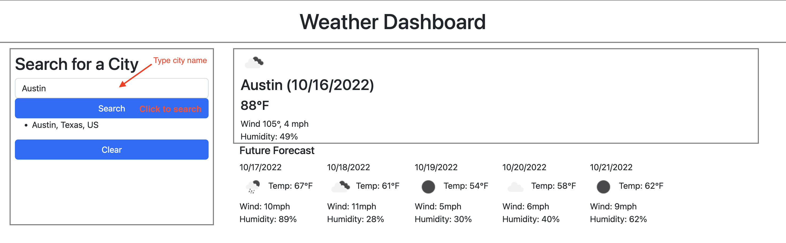
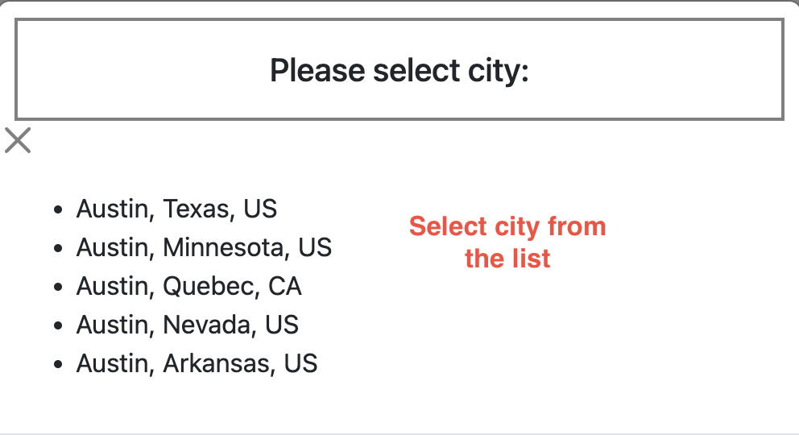

# challenge-6
Weather Dashboard

## Tools Used
- HTML
- Bootstrap
- Day.js
- Javascript
- OpenWeather

## Description
The purpose of this challenge was to practice using a third part API to pull weather data and display desired data. 

## Deployed
[Deployed Application](https://mthomsn.github.io/challenge-6/)

## What I learned
I learned how to work with third party APIs by reading the provided documentation. 

## Credits
[OpenWeather API](https://openweathermap.org/) 
[Day.js](https://day.js.org/) 
[Bootstrap 5](https://getbootstrap.com/)

## Contact me
Email: [matthewthomsen99@gmail.com](mailto:matthewthomsen99@gmail.com?) 
Github: [mthomsn](https://github.com/mthomsn)